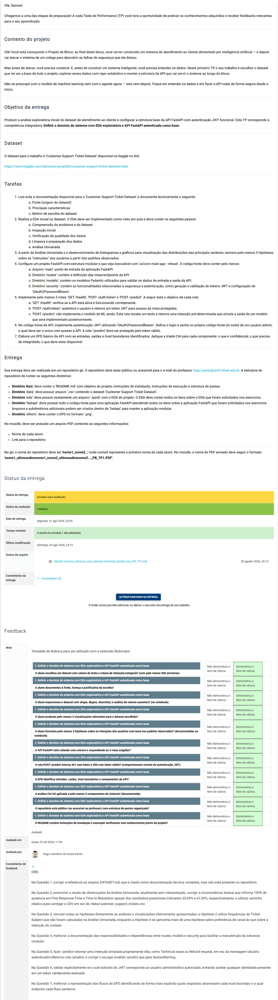

# Projeto de Bloco: Análise e Segurança de Agentes de IA

# TP1 - Questões (7)

### Instalar bibliotecas VSCode

```bash
pip install pandas numpy matplotlib seaborn scipy
```

# Modo de Uso:

- Pasta entregue se refere ao projeto avaliado
- Pasta corrigido se refere ao projeto avaliado com as correções


