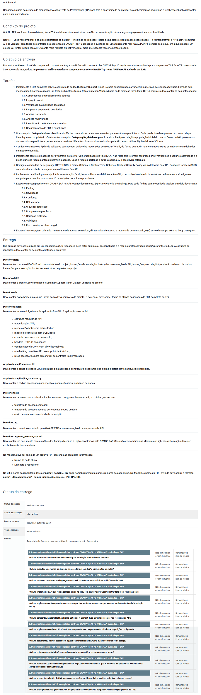

# Projeto de Bloco: Análise e Segurança de Agentes de IA

# TP2 - Questões (8)

# Modo de Uso:

- Pasta entregue se refere ao projeto avaliado
- Pasta corrigido se refere ao projeto avaliado com as correções

## Notion SO

https://app.notion.com/p/11-ET6-30-09-Leitura-TP2-2f7ab4aadb258157bc52c61f08ec5897?source=copy_link

